*Exploratory Data Analysis with R*  

With this RMarkdown document we will present some basic methods to overview given data.

The required R Packages are:

```r
require(tidyverse)   # tidyverse is the sine qua non, see https://www.tidyverse.org/ and includes important packages like tidyr, dplyr, ggplot2, readr, magrittr etc
require(skimr)  # skimr creates nice overview tables and does with dplyr and piping
require(mosaic)  # mosaic includes also ggformula and lattice packages
require(QuantPsyc)   # QuantPsyc delivers useful statistical functions like "Make.Z" and "eda.uni"
```

# Get the full glimpse

We will use the fancy `starwars` dataframe from `{dplyr}` package, and call it `sw` for the sake of convenience.

```r
sw <- starwars   # copy to "sw"
sw   # just view
```

<div data-pagedtable="false">
  <script data-pagedtable-source type="application/json">
{"columns":[{"label":["name"],"name":[1],"type":["chr"],"align":["left"]},{"label":["height"],"name":[2],"type":["int"],"align":["right"]},{"label":["mass"],"name":[3],"type":["dbl"],"align":["right"]},{"label":["hair_color"],"name":[4],"type":["chr"],"align":["left"]},{"label":["skin_color"],"name":[5],"type":["chr"],"align":["left"]},{"label":["eye_color"],"name":[6],"type":["chr"],"align":["left"]},{"label":["birth_year"],"name":[7],"type":["dbl"],"align":["right"]},{"label":["sex"],"name":[8],"type":["chr"],"align":["left"]},{"label":["gender"],"name":[9],"type":["chr"],"align":["left"]},{"label":["homeworld"],"name":[10],"type":["chr"],"align":["left"]},{"label":["species"],"name":[11],"type":["chr"],"align":["left"]},{"label":["films"],"name":[12],"type":["list"],"align":["right"]},{"label":["vehicles"],"name":[13],"type":["list"],"align":["right"]},{"label":["starships"],"name":[14],"type":["list"],"align":["right"]}],"data":[{"1":"Luke Skywalker","2":"172","3":"77.0","4":"blond","5":"fair","6":"blue","7":"19.0","8":"male","9":"masculine","10":"Tatooine","11":"Human","12":"<chr [5]>","13":"<chr [2]>","14":"<chr [2]>"},{"1":"C-3PO","2":"167","3":"75.0","4":"NA","5":"gold","6":"yellow","7":"112.0","8":"none","9":"masculine","10":"Tatooine","11":"Droid","12":"<chr [6]>","13":"<chr [0]>","14":"<chr [0]>"},{"1":"R2-D2","2":"96","3":"32.0","4":"NA","5":"white, blue","6":"red","7":"33.0","8":"none","9":"masculine","10":"Naboo","11":"Droid","12":"<chr [7]>","13":"<chr [0]>","14":"<chr [0]>"},{"1":"Darth Vader","2":"202","3":"136.0","4":"none","5":"white","6":"yellow","7":"41.9","8":"male","9":"masculine","10":"Tatooine","11":"Human","12":"<chr [4]>","13":"<chr [0]>","14":"<chr [1]>"},{"1":"Leia Organa","2":"150","3":"49.0","4":"brown","5":"light","6":"brown","7":"19.0","8":"female","9":"feminine","10":"Alderaan","11":"Human","12":"<chr [5]>","13":"<chr [1]>","14":"<chr [0]>"},{"1":"Owen Lars","2":"178","3":"120.0","4":"brown, grey","5":"light","6":"blue","7":"52.0","8":"male","9":"masculine","10":"Tatooine","11":"Human","12":"<chr [3]>","13":"<chr [0]>","14":"<chr [0]>"},{"1":"Beru Whitesun lars","2":"165","3":"75.0","4":"brown","5":"light","6":"blue","7":"47.0","8":"female","9":"feminine","10":"Tatooine","11":"Human","12":"<chr [3]>","13":"<chr [0]>","14":"<chr [0]>"},{"1":"R5-D4","2":"97","3":"32.0","4":"NA","5":"white, red","6":"red","7":"NA","8":"none","9":"masculine","10":"Tatooine","11":"Droid","12":"<chr [1]>","13":"<chr [0]>","14":"<chr [0]>"},{"1":"Biggs Darklighter","2":"183","3":"84.0","4":"black","5":"light","6":"brown","7":"24.0","8":"male","9":"masculine","10":"Tatooine","11":"Human","12":"<chr [1]>","13":"<chr [0]>","14":"<chr [1]>"},{"1":"Obi-Wan Kenobi","2":"182","3":"77.0","4":"auburn, white","5":"fair","6":"blue-gray","7":"57.0","8":"male","9":"masculine","10":"Stewjon","11":"Human","12":"<chr [6]>","13":"<chr [1]>","14":"<chr [5]>"},{"1":"Anakin Skywalker","2":"188","3":"84.0","4":"blond","5":"fair","6":"blue","7":"41.9","8":"male","9":"masculine","10":"Tatooine","11":"Human","12":"<chr [3]>","13":"<chr [2]>","14":"<chr [3]>"},{"1":"Wilhuff Tarkin","2":"180","3":"NA","4":"auburn, grey","5":"fair","6":"blue","7":"64.0","8":"male","9":"masculine","10":"Eriadu","11":"Human","12":"<chr [2]>","13":"<chr [0]>","14":"<chr [0]>"},{"1":"Chewbacca","2":"228","3":"112.0","4":"brown","5":"unknown","6":"blue","7":"200.0","8":"male","9":"masculine","10":"Kashyyyk","11":"Wookiee","12":"<chr [5]>","13":"<chr [1]>","14":"<chr [2]>"},{"1":"Han Solo","2":"180","3":"80.0","4":"brown","5":"fair","6":"brown","7":"29.0","8":"male","9":"masculine","10":"Corellia","11":"Human","12":"<chr [4]>","13":"<chr [0]>","14":"<chr [2]>"},{"1":"Greedo","2":"173","3":"74.0","4":"NA","5":"green","6":"black","7":"44.0","8":"male","9":"masculine","10":"Rodia","11":"Rodian","12":"<chr [1]>","13":"<chr [0]>","14":"<chr [0]>"},{"1":"Jabba Desilijic Tiure","2":"175","3":"1358.0","4":"NA","5":"green-tan, brown","6":"orange","7":"600.0","8":"hermaphroditic","9":"masculine","10":"Nal Hutta","11":"Hutt","12":"<chr [3]>","13":"<chr [0]>","14":"<chr [0]>"},{"1":"Wedge Antilles","2":"170","3":"77.0","4":"brown","5":"fair","6":"hazel","7":"21.0","8":"male","9":"masculine","10":"Corellia","11":"Human","12":"<chr [3]>","13":"<chr [1]>","14":"<chr [1]>"},{"1":"Jek Tono Porkins","2":"180","3":"110.0","4":"brown","5":"fair","6":"blue","7":"NA","8":"male","9":"masculine","10":"Bestine IV","11":"Human","12":"<chr [1]>","13":"<chr [0]>","14":"<chr [1]>"},{"1":"Yoda","2":"66","3":"17.0","4":"white","5":"green","6":"brown","7":"896.0","8":"male","9":"masculine","10":"NA","11":"Yoda's species","12":"<chr [5]>","13":"<chr [0]>","14":"<chr [0]>"},{"1":"Palpatine","2":"170","3":"75.0","4":"grey","5":"pale","6":"yellow","7":"82.0","8":"male","9":"masculine","10":"Naboo","11":"Human","12":"<chr [5]>","13":"<chr [0]>","14":"<chr [0]>"},{"1":"Boba Fett","2":"183","3":"78.2","4":"black","5":"fair","6":"brown","7":"31.5","8":"male","9":"masculine","10":"Kamino","11":"Human","12":"<chr [3]>","13":"<chr [0]>","14":"<chr [1]>"},{"1":"IG-88","2":"200","3":"140.0","4":"none","5":"metal","6":"red","7":"15.0","8":"none","9":"masculine","10":"NA","11":"Droid","12":"<chr [1]>","13":"<chr [0]>","14":"<chr [0]>"},{"1":"Bossk","2":"190","3":"113.0","4":"none","5":"green","6":"red","7":"53.0","8":"male","9":"masculine","10":"Trandosha","11":"Trandoshan","12":"<chr [1]>","13":"<chr [0]>","14":"<chr [0]>"},{"1":"Lando Calrissian","2":"177","3":"79.0","4":"black","5":"dark","6":"brown","7":"31.0","8":"male","9":"masculine","10":"Socorro","11":"Human","12":"<chr [2]>","13":"<chr [0]>","14":"<chr [1]>"},{"1":"Lobot","2":"175","3":"79.0","4":"none","5":"light","6":"blue","7":"37.0","8":"male","9":"masculine","10":"Bespin","11":"Human","12":"<chr [1]>","13":"<chr [0]>","14":"<chr [0]>"},{"1":"Ackbar","2":"180","3":"83.0","4":"none","5":"brown mottle","6":"orange","7":"41.0","8":"male","9":"masculine","10":"Mon Cala","11":"Mon Calamari","12":"<chr [2]>","13":"<chr [0]>","14":"<chr [0]>"},{"1":"Mon Mothma","2":"150","3":"NA","4":"auburn","5":"fair","6":"blue","7":"48.0","8":"female","9":"feminine","10":"Chandrila","11":"Human","12":"<chr [1]>","13":"<chr [0]>","14":"<chr [0]>"},{"1":"Arvel Crynyd","2":"NA","3":"NA","4":"brown","5":"fair","6":"brown","7":"NA","8":"male","9":"masculine","10":"NA","11":"Human","12":"<chr [1]>","13":"<chr [0]>","14":"<chr [1]>"},{"1":"Wicket Systri Warrick","2":"88","3":"20.0","4":"brown","5":"brown","6":"brown","7":"8.0","8":"male","9":"masculine","10":"Endor","11":"Ewok","12":"<chr [1]>","13":"<chr [0]>","14":"<chr [0]>"},{"1":"Nien Nunb","2":"160","3":"68.0","4":"none","5":"grey","6":"black","7":"NA","8":"male","9":"masculine","10":"Sullust","11":"Sullustan","12":"<chr [1]>","13":"<chr [0]>","14":"<chr [1]>"},{"1":"Qui-Gon Jinn","2":"193","3":"89.0","4":"brown","5":"fair","6":"blue","7":"92.0","8":"male","9":"masculine","10":"NA","11":"Human","12":"<chr [1]>","13":"<chr [1]>","14":"<chr [0]>"},{"1":"Nute Gunray","2":"191","3":"90.0","4":"none","5":"mottled green","6":"red","7":"NA","8":"male","9":"masculine","10":"Cato Neimoidia","11":"Neimodian","12":"<chr [3]>","13":"<chr [0]>","14":"<chr [0]>"},{"1":"Finis Valorum","2":"170","3":"NA","4":"blond","5":"fair","6":"blue","7":"91.0","8":"male","9":"masculine","10":"Coruscant","11":"Human","12":"<chr [1]>","13":"<chr [0]>","14":"<chr [0]>"},{"1":"Jar Jar Binks","2":"196","3":"66.0","4":"none","5":"orange","6":"orange","7":"52.0","8":"male","9":"masculine","10":"Naboo","11":"Gungan","12":"<chr [2]>","13":"<chr [0]>","14":"<chr [0]>"},{"1":"Roos Tarpals","2":"224","3":"82.0","4":"none","5":"grey","6":"orange","7":"NA","8":"male","9":"masculine","10":"Naboo","11":"Gungan","12":"<chr [1]>","13":"<chr [0]>","14":"<chr [0]>"},{"1":"Rugor Nass","2":"206","3":"NA","4":"none","5":"green","6":"orange","7":"NA","8":"male","9":"masculine","10":"Naboo","11":"Gungan","12":"<chr [1]>","13":"<chr [0]>","14":"<chr [0]>"},{"1":"Ric Olié","2":"183","3":"NA","4":"brown","5":"fair","6":"blue","7":"NA","8":"NA","9":"NA","10":"Naboo","11":"NA","12":"<chr [1]>","13":"<chr [0]>","14":"<chr [1]>"},{"1":"Watto","2":"137","3":"NA","4":"black","5":"blue, grey","6":"yellow","7":"NA","8":"male","9":"masculine","10":"Toydaria","11":"Toydarian","12":"<chr [2]>","13":"<chr [0]>","14":"<chr [0]>"},{"1":"Sebulba","2":"112","3":"40.0","4":"none","5":"grey, red","6":"orange","7":"NA","8":"male","9":"masculine","10":"Malastare","11":"Dug","12":"<chr [1]>","13":"<chr [0]>","14":"<chr [0]>"},{"1":"Quarsh Panaka","2":"183","3":"NA","4":"black","5":"dark","6":"brown","7":"62.0","8":"NA","9":"NA","10":"Naboo","11":"NA","12":"<chr [1]>","13":"<chr [0]>","14":"<chr [0]>"},{"1":"Shmi Skywalker","2":"163","3":"NA","4":"black","5":"fair","6":"brown","7":"72.0","8":"female","9":"feminine","10":"Tatooine","11":"Human","12":"<chr [2]>","13":"<chr [0]>","14":"<chr [0]>"},{"1":"Darth Maul","2":"175","3":"80.0","4":"none","5":"red","6":"yellow","7":"54.0","8":"male","9":"masculine","10":"Dathomir","11":"Zabrak","12":"<chr [1]>","13":"<chr [1]>","14":"<chr [1]>"},{"1":"Bib Fortuna","2":"180","3":"NA","4":"none","5":"pale","6":"pink","7":"NA","8":"male","9":"masculine","10":"Ryloth","11":"Twi'lek","12":"<chr [1]>","13":"<chr [0]>","14":"<chr [0]>"},{"1":"Ayla Secura","2":"178","3":"55.0","4":"none","5":"blue","6":"hazel","7":"48.0","8":"female","9":"feminine","10":"Ryloth","11":"Twi'lek","12":"<chr [3]>","13":"<chr [0]>","14":"<chr [0]>"},{"1":"Dud Bolt","2":"94","3":"45.0","4":"none","5":"blue, grey","6":"yellow","7":"NA","8":"male","9":"masculine","10":"Vulpter","11":"Vulptereen","12":"<chr [1]>","13":"<chr [0]>","14":"<chr [0]>"},{"1":"Gasgano","2":"122","3":"NA","4":"none","5":"white, blue","6":"black","7":"NA","8":"male","9":"masculine","10":"Troiken","11":"Xexto","12":"<chr [1]>","13":"<chr [0]>","14":"<chr [0]>"},{"1":"Ben Quadinaros","2":"163","3":"65.0","4":"none","5":"grey, green, yellow","6":"orange","7":"NA","8":"male","9":"masculine","10":"Tund","11":"Toong","12":"<chr [1]>","13":"<chr [0]>","14":"<chr [0]>"},{"1":"Mace Windu","2":"188","3":"84.0","4":"none","5":"dark","6":"brown","7":"72.0","8":"male","9":"masculine","10":"Haruun Kal","11":"Human","12":"<chr [3]>","13":"<chr [0]>","14":"<chr [0]>"},{"1":"Ki-Adi-Mundi","2":"198","3":"82.0","4":"white","5":"pale","6":"yellow","7":"92.0","8":"male","9":"masculine","10":"Cerea","11":"Cerean","12":"<chr [3]>","13":"<chr [0]>","14":"<chr [0]>"},{"1":"Kit Fisto","2":"196","3":"87.0","4":"none","5":"green","6":"black","7":"NA","8":"male","9":"masculine","10":"Glee Anselm","11":"Nautolan","12":"<chr [3]>","13":"<chr [0]>","14":"<chr [0]>"},{"1":"Eeth Koth","2":"171","3":"NA","4":"black","5":"brown","6":"brown","7":"NA","8":"male","9":"masculine","10":"Iridonia","11":"Zabrak","12":"<chr [2]>","13":"<chr [0]>","14":"<chr [0]>"},{"1":"Adi Gallia","2":"184","3":"50.0","4":"none","5":"dark","6":"blue","7":"NA","8":"female","9":"feminine","10":"Coruscant","11":"Tholothian","12":"<chr [2]>","13":"<chr [0]>","14":"<chr [0]>"},{"1":"Saesee Tiin","2":"188","3":"NA","4":"none","5":"pale","6":"orange","7":"NA","8":"male","9":"masculine","10":"Iktotch","11":"Iktotchi","12":"<chr [2]>","13":"<chr [0]>","14":"<chr [0]>"},{"1":"Yarael Poof","2":"264","3":"NA","4":"none","5":"white","6":"yellow","7":"NA","8":"male","9":"masculine","10":"Quermia","11":"Quermian","12":"<chr [1]>","13":"<chr [0]>","14":"<chr [0]>"},{"1":"Plo Koon","2":"188","3":"80.0","4":"none","5":"orange","6":"black","7":"22.0","8":"male","9":"masculine","10":"Dorin","11":"Kel Dor","12":"<chr [3]>","13":"<chr [0]>","14":"<chr [1]>"},{"1":"Mas Amedda","2":"196","3":"NA","4":"none","5":"blue","6":"blue","7":"NA","8":"male","9":"masculine","10":"Champala","11":"Chagrian","12":"<chr [2]>","13":"<chr [0]>","14":"<chr [0]>"},{"1":"Gregar Typho","2":"185","3":"85.0","4":"black","5":"dark","6":"brown","7":"NA","8":"male","9":"masculine","10":"Naboo","11":"Human","12":"<chr [1]>","13":"<chr [0]>","14":"<chr [1]>"},{"1":"Cordé","2":"157","3":"NA","4":"brown","5":"light","6":"brown","7":"NA","8":"female","9":"feminine","10":"Naboo","11":"Human","12":"<chr [1]>","13":"<chr [0]>","14":"<chr [0]>"},{"1":"Cliegg Lars","2":"183","3":"NA","4":"brown","5":"fair","6":"blue","7":"82.0","8":"male","9":"masculine","10":"Tatooine","11":"Human","12":"<chr [1]>","13":"<chr [0]>","14":"<chr [0]>"},{"1":"Poggle the Lesser","2":"183","3":"80.0","4":"none","5":"green","6":"yellow","7":"NA","8":"male","9":"masculine","10":"Geonosis","11":"Geonosian","12":"<chr [2]>","13":"<chr [0]>","14":"<chr [0]>"},{"1":"Luminara Unduli","2":"170","3":"56.2","4":"black","5":"yellow","6":"blue","7":"58.0","8":"female","9":"feminine","10":"Mirial","11":"Mirialan","12":"<chr [2]>","13":"<chr [0]>","14":"<chr [0]>"},{"1":"Barriss Offee","2":"166","3":"50.0","4":"black","5":"yellow","6":"blue","7":"40.0","8":"female","9":"feminine","10":"Mirial","11":"Mirialan","12":"<chr [1]>","13":"<chr [0]>","14":"<chr [0]>"},{"1":"Dormé","2":"165","3":"NA","4":"brown","5":"light","6":"brown","7":"NA","8":"female","9":"feminine","10":"Naboo","11":"Human","12":"<chr [1]>","13":"<chr [0]>","14":"<chr [0]>"},{"1":"Dooku","2":"193","3":"80.0","4":"white","5":"fair","6":"brown","7":"102.0","8":"male","9":"masculine","10":"Serenno","11":"Human","12":"<chr [2]>","13":"<chr [1]>","14":"<chr [0]>"},{"1":"Bail Prestor Organa","2":"191","3":"NA","4":"black","5":"tan","6":"brown","7":"67.0","8":"male","9":"masculine","10":"Alderaan","11":"Human","12":"<chr [2]>","13":"<chr [0]>","14":"<chr [0]>"},{"1":"Jango Fett","2":"183","3":"79.0","4":"black","5":"tan","6":"brown","7":"66.0","8":"male","9":"masculine","10":"Concord Dawn","11":"Human","12":"<chr [1]>","13":"<chr [0]>","14":"<chr [0]>"},{"1":"Zam Wesell","2":"168","3":"55.0","4":"blonde","5":"fair, green, yellow","6":"yellow","7":"NA","8":"female","9":"feminine","10":"Zolan","11":"Clawdite","12":"<chr [1]>","13":"<chr [1]>","14":"<chr [0]>"},{"1":"Dexter Jettster","2":"198","3":"102.0","4":"none","5":"brown","6":"yellow","7":"NA","8":"male","9":"masculine","10":"Ojom","11":"Besalisk","12":"<chr [1]>","13":"<chr [0]>","14":"<chr [0]>"},{"1":"Lama Su","2":"229","3":"88.0","4":"none","5":"grey","6":"black","7":"NA","8":"male","9":"masculine","10":"Kamino","11":"Kaminoan","12":"<chr [1]>","13":"<chr [0]>","14":"<chr [0]>"},{"1":"Taun We","2":"213","3":"NA","4":"none","5":"grey","6":"black","7":"NA","8":"female","9":"feminine","10":"Kamino","11":"Kaminoan","12":"<chr [1]>","13":"<chr [0]>","14":"<chr [0]>"},{"1":"Jocasta Nu","2":"167","3":"NA","4":"white","5":"fair","6":"blue","7":"NA","8":"female","9":"feminine","10":"Coruscant","11":"Human","12":"<chr [1]>","13":"<chr [0]>","14":"<chr [0]>"},{"1":"Ratts Tyerell","2":"79","3":"15.0","4":"none","5":"grey, blue","6":"unknown","7":"NA","8":"male","9":"masculine","10":"Aleen Minor","11":"Aleena","12":"<chr [1]>","13":"<chr [0]>","14":"<chr [0]>"},{"1":"R4-P17","2":"96","3":"NA","4":"none","5":"silver, red","6":"red, blue","7":"NA","8":"none","9":"feminine","10":"NA","11":"Droid","12":"<chr [2]>","13":"<chr [0]>","14":"<chr [0]>"},{"1":"Wat Tambor","2":"193","3":"48.0","4":"none","5":"green, grey","6":"unknown","7":"NA","8":"male","9":"masculine","10":"Skako","11":"Skakoan","12":"<chr [1]>","13":"<chr [0]>","14":"<chr [0]>"},{"1":"San Hill","2":"191","3":"NA","4":"none","5":"grey","6":"gold","7":"NA","8":"male","9":"masculine","10":"Muunilinst","11":"Muun","12":"<chr [1]>","13":"<chr [0]>","14":"<chr [0]>"},{"1":"Shaak Ti","2":"178","3":"57.0","4":"none","5":"red, blue, white","6":"black","7":"NA","8":"female","9":"feminine","10":"Shili","11":"Togruta","12":"<chr [2]>","13":"<chr [0]>","14":"<chr [0]>"},{"1":"Grievous","2":"216","3":"159.0","4":"none","5":"brown, white","6":"green, yellow","7":"NA","8":"male","9":"masculine","10":"Kalee","11":"Kaleesh","12":"<chr [1]>","13":"<chr [1]>","14":"<chr [1]>"},{"1":"Tarfful","2":"234","3":"136.0","4":"brown","5":"brown","6":"blue","7":"NA","8":"male","9":"masculine","10":"Kashyyyk","11":"Wookiee","12":"<chr [1]>","13":"<chr [0]>","14":"<chr [0]>"},{"1":"Raymus Antilles","2":"188","3":"79.0","4":"brown","5":"light","6":"brown","7":"NA","8":"male","9":"masculine","10":"Alderaan","11":"Human","12":"<chr [2]>","13":"<chr [0]>","14":"<chr [0]>"},{"1":"Sly Moore","2":"178","3":"48.0","4":"none","5":"pale","6":"white","7":"NA","8":"NA","9":"NA","10":"Umbara","11":"NA","12":"<chr [2]>","13":"<chr [0]>","14":"<chr [0]>"},{"1":"Tion Medon","2":"206","3":"80.0","4":"none","5":"grey","6":"black","7":"NA","8":"male","9":"masculine","10":"Utapau","11":"Pau'an","12":"<chr [1]>","13":"<chr [0]>","14":"<chr [0]>"},{"1":"Finn","2":"NA","3":"NA","4":"black","5":"dark","6":"dark","7":"NA","8":"male","9":"masculine","10":"NA","11":"Human","12":"<chr [1]>","13":"<chr [0]>","14":"<chr [0]>"},{"1":"Rey","2":"NA","3":"NA","4":"brown","5":"light","6":"hazel","7":"NA","8":"female","9":"feminine","10":"NA","11":"Human","12":"<chr [1]>","13":"<chr [0]>","14":"<chr [0]>"},{"1":"Poe Dameron","2":"NA","3":"NA","4":"brown","5":"light","6":"brown","7":"NA","8":"male","9":"masculine","10":"NA","11":"Human","12":"<chr [1]>","13":"<chr [0]>","14":"<chr [1]>"},{"1":"BB8","2":"NA","3":"NA","4":"none","5":"none","6":"black","7":"NA","8":"none","9":"masculine","10":"NA","11":"Droid","12":"<chr [1]>","13":"<chr [0]>","14":"<chr [0]>"},{"1":"Captain Phasma","2":"NA","3":"NA","4":"unknown","5":"unknown","6":"unknown","7":"NA","8":"NA","9":"NA","10":"NA","11":"NA","12":"<chr [1]>","13":"<chr [0]>","14":"<chr [0]>"},{"1":"Padmé Amidala","2":"165","3":"45.0","4":"brown","5":"light","6":"brown","7":"46.0","8":"female","9":"feminine","10":"Naboo","11":"Human","12":"<chr [3]>","13":"<chr [0]>","14":"<chr [3]>"}],"options":{"columns":{"min":{},"max":[10]},"rows":{"min":[10],"max":[10]},"pages":{}}}
  </script>
</div>

For plain R output there is a concise first viewing option of a dataframe with the `glimpse` command.

```r
glimpse(sw)
```

```
## Rows: 87
## Columns: 14
## $ name       <chr> "Luke Skywalker", "C-3PO", "R2-D2", "Darth Vader", "Leia...
## $ height     <int> 172, 167, 96, 202, 150, 178, 165, 97, 183, 182, 188, 180...
## $ mass       <dbl> 77.0, 75.0, 32.0, 136.0, 49.0, 120.0, 75.0, 32.0, 84.0, ...
## $ hair_color <chr> "blond", NA, NA, "none", "brown", "brown, grey", "brown"...
## $ skin_color <chr> "fair", "gold", "white, blue", "white", "light", "light"...
## $ eye_color  <chr> "blue", "yellow", "red", "yellow", "brown", "blue", "blu...
## $ birth_year <dbl> 19.0, 112.0, 33.0, 41.9, 19.0, 52.0, 47.0, NA, 24.0, 57....
## $ sex        <chr> "male", "none", "none", "male", "female", "male", "femal...
## $ gender     <chr> "masculine", "masculine", "masculine", "masculine", "fem...
## $ homeworld  <chr> "Tatooine", "Tatooine", "Naboo", "Tatooine", "Alderaan",...
## $ species    <chr> "Human", "Droid", "Droid", "Human", "Human", "Human", "H...
## $ films      <list> [<"The Empire Strikes Back", "Revenge of the Sith", "Re...
## $ vehicles   <list> [<"Snowspeeder", "Imperial Speeder Bike">, <>, <>, <>, ...
## $ starships  <list> [<"X-wing", "Imperial shuttle">, <>, <>, "TIE Advanced ...
```

There are 14 variables, of which 3 are a list type. The other variables are numbers or characters, last ones partly better to be transformed into categorical (i.e. factor or dummy) variables.  
Before we transform them, we might look at their unique values. Also "NA"s, R's term for non-existent values, are printed.

```r
# show unique values for the specified variable, here columns 9, "gender" and 4, "hair_color" - which indeed is a tiny example of a for-loop
for (i in c(9,4)) {
       unique(sw[,i]) %>% print.AsIs()  
}
```

```
##      gender
## 1 masculine
## 2  feminine
## 3      <NA>
##       hair_color
## 1          blond
## 2           <NA>
## 3           none
## 4          brown
## 5    brown, grey
## 6          black
## 7  auburn, white
## 8   auburn, grey
## 9          white
## 10          grey
## 11        auburn
## 12        blonde
## 13       unknown
```

We might notice that there are 2 different "blond/blonde" values in `hair_color`. Let's change this!  
We'll use the pipe `%>%` formula as we take the `sw` dataframe, do the mutation and write it back to `sw`.  
Second, we turn `hair_color` into a factor variable.

```r
sw <- sw %>% mutate(hair_color = replace(hair_color, which(hair_color=="blonde"), "blond")) 
sw$hair_color <- as.factor(sw$hair_color)
```

Here's one more, very concise overview option (also using the pipe formula) -- which may help best at large datasets.

```r
skim(sw) %>% summary()  
```

Table: Data summary

|                         |     |
|:------------------------|:----|
|Name                     |sw   |
|Number of rows           |87   |
|Number of columns        |14   |
|_______________________  |     |
|Column type frequency:   |     |
|character                |7    |
|factor                   |1    |
|list                     |3    |
|numeric                  |3    |
|________________________ |     |
|Group variables          |None |
  
  

Before continue with overview statistics we might get clear about adressing and accessing parts of the dataframe. So-called *subsetting* a dataframe in R ist quite easy to do, you just need to adress the relevant rows and/or columns by numbers in squared brackets, and use the vector format `c(x,y,z)` for multiple ones. (Of course there are more elaborate options to do this, but for now we stick to shortness and the usage in the functions beneath.)

```r
sw[1:5, c(1,6:4)]   # first 5 rows of columns 1, 6, 5, 4
```

<div data-pagedtable="false">
  <script data-pagedtable-source type="application/json">
{"columns":[{"label":["name"],"name":[1],"type":["chr"],"align":["left"]},{"label":["eye_color"],"name":[2],"type":["chr"],"align":["left"]},{"label":["skin_color"],"name":[3],"type":["chr"],"align":["left"]},{"label":["hair_color"],"name":[4],"type":["fctr"],"align":["left"]}],"data":[{"1":"Luke Skywalker","2":"blue","3":"fair","4":"blond"},{"1":"C-3PO","2":"yellow","3":"gold","4":"NA"},{"1":"R2-D2","2":"red","3":"white, blue","4":"NA"},{"1":"Darth Vader","2":"yellow","3":"white","4":"none"},{"1":"Leia Organa","2":"brown","3":"light","4":"brown"}],"options":{"columns":{"min":{},"max":[10]},"rows":{"min":[10],"max":[10]},"pages":{}}}
  </script>
</div>

```r
sw[3, -c(5:ncol(sw))]   # row 3 with columns 1 to 4 by sorting out columns 5 to the last
```

<div data-pagedtable="false">
  <script data-pagedtable-source type="application/json">
{"columns":[{"label":["name"],"name":[1],"type":["chr"],"align":["left"]},{"label":["height"],"name":[2],"type":["int"],"align":["right"]},{"label":["mass"],"name":[3],"type":["dbl"],"align":["right"]},{"label":["hair_color"],"name":[4],"type":["fctr"],"align":["left"]}],"data":[{"1":"R2-D2","2":"96","3":"32","4":"NA"}],"options":{"columns":{"min":{},"max":[10]},"rows":{"min":[10],"max":[10]},"pages":{}}}
  </script>
</div>

   
Let's now get a better insight into certain variables. For this we use the `skim` function from the package `{skimr}`. (Of course you can also "skim" the whole dataframe if you want to: It might deliver a large table, anyway.) `skim` gives us very useful basic statistics for the chosen variables according to their type, and even a mini histogram where appropriate.
Therefore, `skim` is very useful at checking for missing values (and their share), whitespaces and unique values, and also a first glimpse of the single variate distributions.

```r
# skimming a character, numerical, integer, factor variable
skim(sw, sex, birth_year, height, hair_color)   # alternatively use column numbers like "skim(sw, c(8, 7, 2, 4))"
```


Table: Data summary

|                         |     |
|:------------------------|:----|
|Name                     |sw   |
|Number of rows           |87   |
|Number of columns        |14   |
|_______________________  |     |
|Column type frequency:   |     |
|character                |1    |
|factor                   |1    |
|numeric                  |2    |
|________________________ |     |
|Group variables          |None |


**Variable type: character**

|skim_variable | n_missing| complete_rate| min| max| empty| n_unique| whitespace|
|:-------------|---------:|-------------:|---:|---:|-----:|--------:|----------:|
|sex           |         4|          0.95|   4|  14|     0|        4|          0|


**Variable type: factor**

|skim_variable | n_missing| complete_rate|ordered | n_unique|top_counts                        |
|:-------------|---------:|-------------:|:-------|--------:|:---------------------------------|
|hair_color    |         5|          0.94|FALSE   |       11|non: 37, bro: 18, bla: 13, blo: 4 |


**Variable type: numeric**

|skim_variable | n_missing| complete_rate|   mean|     sd| p0| p25| p50| p75| p100|hist                                     |
|:-------------|---------:|-------------:|------:|------:|--:|---:|---:|---:|----:|:----------------------------------------|
|birth_year    |        44|          0.49|  87.57| 154.69|  8|  35|  52|  72|  896|▇▁▁▁▁ |
|height        |         6|          0.93| 174.36|  34.77| 66| 167| 180| 191|  264|▁▁▇▅▁ |


We also turn the other appropriate variables into factors and may check with `glimpse` one more time.

```r
sw[,c(5:6,8:11)] <- lapply(sw[,c(5:6,8:11)], as.factor)   # turning columns 5, 6 and 8 to 11 into factors
glimpse(sw)
```

```
## Rows: 87
## Columns: 14
## $ name       <chr> "Luke Skywalker", "C-3PO", "R2-D2", "Darth Vader", "Leia...
## $ height     <int> 172, 167, 96, 202, 150, 178, 165, 97, 183, 182, 188, 180...
## $ mass       <dbl> 77.0, 75.0, 32.0, 136.0, 49.0, 120.0, 75.0, 32.0, 84.0, ...
## $ hair_color <fct> "blond", NA, NA, "none", "brown", "brown, grey", "brown"...
## $ skin_color <fct> "fair", "gold", "white, blue", "white", "light", "light"...
## $ eye_color  <fct> blue, yellow, red, yellow, brown, blue, blue, red, brown...
## $ birth_year <dbl> 19.0, 112.0, 33.0, 41.9, 19.0, 52.0, 47.0, NA, 24.0, 57....
## $ sex        <fct> male, none, none, male, female, male, female, none, male...
## $ gender     <fct> masculine, masculine, masculine, masculine, feminine, ma...
## $ homeworld  <fct> Tatooine, Tatooine, Naboo, Tatooine, Alderaan, Tatooine,...
## $ species    <fct> Human, Droid, Droid, Human, Human, Human, Human, Droid, ...
## $ films      <list> [<"The Empire Strikes Back", "Revenge of the Sith", "Re...
## $ vehicles   <list> [<"Snowspeeder", "Imperial Speeder Bike">, <>, <>, <>, ...
## $ starships  <list> [<"X-wing", "Imperial shuttle">, <>, <>, "TIE Advanced ...
```

## Inspect a subset

We might take a look at a specific subset of the whole dataset.

With base R `sapply` there is a single command to apply the same function to several variables or the whole dataframe.

```r
sapply(sw[,c(4:6,8:11)], nlevels)    # number of levels for the categoricals (columns 4 to 6 and 8 to 11)
```

```
## hair_color skin_color  eye_color        sex     gender  homeworld    species 
##         11         31         15          4          2         48         37
```

```r
sapply(sw[,2:3], median, na.rm=T)    # median score for the numericals (columns 2 and 3); "na.rm" for ignoring the NA's
```

```
## height   mass 
##    180     79
```


The function `select` from `{dplyr}` offers a kind way of including or excluding variables, which pays off best using it in building a data pipe. After selecting you can continue with various statistical functions like `summary` here.

```r
sw %>% dplyr::select(-c(name,films, vehicles, starships, c(4:7))) %>%    # exclude certain variables
  summary()     # statistical summaries for the left variables
```

```
##      height           mass                     sex           gender  
##  Min.   : 66.0   Min.   :  15.00   female        :16   feminine :17  
##  1st Qu.:167.0   1st Qu.:  55.60   hermaphroditic: 1   masculine:66  
##  Median :180.0   Median :  79.00   male          :60   NA's     : 4  
##  Mean   :174.4   Mean   :  97.31   none          : 6                 
##  3rd Qu.:191.0   3rd Qu.:  84.50   NA's          : 4                 
##  Max.   :264.0   Max.   :1358.00                                     
##  NA's   :6       NA's   :28                                          
##      homeworld      species  
##  Naboo    :11   Human   :35  
##  Tatooine :10   Droid   : 6  
##  Alderaan : 3   Gungan  : 3  
##  Coruscant: 3   Kaminoan: 2  
##  Kamino   : 3   Mirialan: 2  
##  (Other)  :47   (Other) :35  
##  NA's     :10   NA's    : 4
```


# Looking at individual variables

The tiny `str` command will generally check of which type or structure a variable or any R object is, with it's sibling `summary` it is also used beyond EDA.

```r
str(sw$sex)
```

```
##  Factor w/ 4 levels "female","hermaphroditic",..: 3 4 4 3 1 3 1 4 3 3 ...
```

```r
str(sw$name)
```

```
##  chr [1:87] "Luke Skywalker" "C-3PO" "R2-D2" "Darth Vader" "Leia Organa" ...
```

```r
str(sw$birth_year)
```

```
##  num [1:87] 19 112 33 41.9 19 52 47 NA 24 57 ...
```


## Numerical (continuous) variables

For numerical variables there are dedicated statistical commands like:

```r
summary(sw$birth_year)     
```

```
##    Min. 1st Qu.  Median    Mean 3rd Qu.    Max.    NA's 
##    8.00   35.00   52.00   87.57   72.00  896.00      44
```

```r
range(sw$birth_year, na.rm=T)  # note another option for dealing with NA's
```

```
## [1]   8 896
```

```r
quantile(sw$height, probs=0.8, na.rm=T)  # 8th quantile
```

```
## 80% 
## 193
```

```r
top_counts(sw$height, max_levels=5)  # top 5 values with counts
```

```
## [1] "183: 7, 180: 5, 188: 5, 170: 4, 178: 4"
```


Also, there are options which deliver the numbers in particular output formats, like `skim` we already know. `df_stats` from the `{ggformula}` package creates a dataframe, and can also be adapted.

```r
skim(sw$birth_year)     # for further options with skim see above
```


Table: Data summary

|                         |              |
|:------------------------|:-------------|
|Name                     |sw$birth_year |
|Number of rows           |87            |
|Number of columns        |1             |
|_______________________  |              |
|Column type frequency:   |              |
|numeric                  |1             |
|________________________ |              |
|Group variables          |None          |


**Variable type: numeric**

|skim_variable | n_missing| complete_rate|  mean|     sd| p0| p25| p50| p75| p100|hist                                     |
|:-------------|---------:|-------------:|-----:|------:|--:|---:|---:|---:|----:|:----------------------------------------|
|data          |        44|          0.49| 87.57| 154.69|  8|  35|  52|  72|  896|▇▁▁▁▁ |

```r
df_stats(~ mass, data=sw)    # standard view by df_stats
```

<div data-pagedtable="false">
  <script data-pagedtable-source type="application/json">
{"columns":[{"label":["response"],"name":[1],"type":["chr"],"align":["left"]},{"label":["min"],"name":[2],"type":["dbl"],"align":["right"]},{"label":["Q1"],"name":[3],"type":["dbl"],"align":["right"]},{"label":["median"],"name":[4],"type":["dbl"],"align":["right"]},{"label":["Q3"],"name":[5],"type":["dbl"],"align":["right"]},{"label":["max"],"name":[6],"type":["dbl"],"align":["right"]},{"label":["mean"],"name":[7],"type":["dbl"],"align":["right"]},{"label":["sd"],"name":[8],"type":["dbl"],"align":["right"]},{"label":["n"],"name":[9],"type":["int"],"align":["right"]},{"label":["missing"],"name":[10],"type":["int"],"align":["right"]}],"data":[{"1":"mass","2":"15","3":"55.6","4":"79","5":"84.5","6":"1358","7":"97.31186","8":"169.4572","9":"59","10":"28"}],"options":{"columns":{"min":{},"max":[10]},"rows":{"min":[10],"max":[10]},"pages":{}}}
  </script>
</div>

```r
df_stats(~ mass, data=sw, quantile, iqr, mad)   # adapted df_stats output
```

```
## Warning: Excluding 28 rows due to missing data [df_stats()].
```

<div data-pagedtable="false">
  <script data-pagedtable-source type="application/json">
{"columns":[{"label":["response"],"name":[1],"type":["chr"],"align":["left"]},{"label":["0%"],"name":[2],"type":["dbl"],"align":["right"]},{"label":["25%"],"name":[3],"type":["dbl"],"align":["right"]},{"label":["50%"],"name":[4],"type":["dbl"],"align":["right"]},{"label":["75%"],"name":[5],"type":["dbl"],"align":["right"]},{"label":["100%"],"name":[6],"type":["dbl"],"align":["right"]},{"label":["iqr"],"name":[7],"type":["dbl"],"align":["right"]},{"label":["mad"],"name":[8],"type":["dbl"],"align":["right"]}],"data":[{"1":"mass","2":"15","3":"55.6","4":"79","5":"84.5","6":"1358","7":"28.9","8":"16.3086"}],"options":{"columns":{"min":{},"max":[10]},"rows":{"min":[10],"max":[10]},"pages":{}}}
  </script>
</div>


Turning numerical values into standard normal values can be done in a quite a simple way using the `Make.Z` command, or alternatively with `scale`. Both can be also applied on whole dataframes.

```r
sw$heightZ <- Make.Z(sw$height)   # converting into z-scores (standard-normal) 
sw$massZ <- scale(sw$mass)  # same for mass, with scale()
# as.data.frame(Make.Z(x))   # back converting into dataframe, when Make.Z is applied to a whole dataframe
```


## Categorical (factor) variables

For factor variables there are several ways for inspecting them. 

```r
summary(sw$gender)  # levels with counts, with NA's
```

```
##  feminine masculine      NA's 
##        17        66         4
```

```r
mosaic::tally(~gender, data=sw)   # gives a nice print out 
```

```
## gender
##  feminine masculine      <NA> 
##        17        66         4
```

```r
levels(sw$gender)  # only levels, without counts, without NA's
```

```
## [1] "feminine"  "masculine"
```

```r
skim(sw$gender)   # for further options with skim see above
```


Table: Data summary

|                         |          |
|:------------------------|:---------|
|Name                     |sw$gender |
|Number of rows           |87        |
|Number of columns        |1         |
|_______________________  |          |
|Column type frequency:   |          |
|factor                   |1         |
|________________________ |          |
|Group variables          |None      |


**Variable type: factor**

|skim_variable | n_missing| complete_rate|ordered | n_unique|top_counts       |
|:-------------|---------:|-------------:|:-------|--------:|:----------------|
|data          |         4|          0.95|FALSE   |        2|mas: 66, fem: 17 |

Why it is worth knowing various of them? For instance, you can use them to address particular data.

```r
levels(sw$gender)[1] 
```

```
## [1] "feminine"
```

```r
summary(sw$gender)[3]
```

```
## NA's 
##    4
```


For combining in 2 factor variables into a cross table you can use `table` or the `tally` command from `{mosaic}` package -- they differ in handling the NA's.

```r
table(sw$gender, sw$sex)   # crosstable with NA's being ignored; more options are available with xtabs()
```

```
##            
##             female hermaphroditic male none
##   feminine      16              0    0    1
##   masculine      0              1   60    5
```

```r
mosaic::tally(gender ~ sex, data=sw)  # crosstable including NA's
```

```
##            sex
## gender      female hermaphroditic male none <NA>
##   feminine      16              0    0    1    0
##   masculine      0              1   60    5    0
##   <NA>           0              0    0    0    4
```

There is also a way to have an insight of the distribution of factor variables using the `top_levels` command from the `{janitor}` package.
Note how we use a command  from a package NOT sourced in this R/RMarkdown script -- that's a stunning feature of R.

```r
janitor::top_levels(sw$eye_color, n=3, show_na=T)  # n = number in top & bottom group
```

<div data-pagedtable="false">
  <script data-pagedtable-source type="application/json">
{"columns":[{"label":["sw$eye_color"],"name":[1],"type":["fctr"],"align":["left"]},{"label":["n"],"name":[2],"type":["dbl"],"align":["right"]},{"label":["percent"],"name":[3],"type":["dbl"],"align":["right"]}],"data":[{"1":"black, blue, blue-gray","2":"30","3":"0.3448276"},{"1":"<<< Middle Group (9 categories) >>>","2":"42","3":"0.4827586"},{"1":"unknown, white, yellow","2":"15","3":"0.1724138"}],"options":{"columns":{"min":{},"max":[10]},"rows":{"min":[10],"max":[10]},"pages":{}}}
  </script>
</div>

Remember `skim` above? Of course you can use `skim` for inspecting a single variable. But you can even adjust `skim` to your own needs. Just write a small function with the `skim_with` command like "my_skim" with MAD, IQR and 10th quantile here.

```r
my_skim <- skim_with(
  numeric = sfl(mad = mad, iqr = IQR, p10 = ~ quantile(., probs = .1)), append = F)
# my_skim(sw$mass)  # What's the problem here?
```

Different R functions ignore or don't ignore NA's in calculating, as we might have seen. Often bug fixing is just to take NA's explicitly into account, for instance with the `na.omit` command.

```r
my_skim(na.omit(sw$mass)) 
```


Table: Data summary

|                         |                 |
|:------------------------|:----------------|
|Name                     |na.omit(sw$mass) |
|Number of rows           |59               |
|Number of columns        |1                |
|_______________________  |                 |
|Column type frequency:   |                 |
|numeric                  |1                |
|________________________ |                 |
|Group variables          |None             |


**Variable type: numeric**

|skim_variable | n_missing| complete_rate|   mad|  iqr| p10|
|:-------------|---------:|-------------:|-----:|----:|---:|
|data          |         0|             1| 16.31| 28.9|  44|


## Grouped variables statistics

The `{dplyr}` function `group_by` easily splits the dataframe into groups along certain variables (factors and numerical!) and works fine with the pipe.

```r
sw %>% dplyr::group_by(gender) %>%    # building groups by gender
    dplyr::select(c(2:4))   %>%     # reducing the output by select only a few columns
         skim()     # skim overview according to the gender groups
```

```
## Adding missing grouping variables: `gender`
```


Table: Data summary

|                         |           |
|:------------------------|:----------|
|Name                     |Piped data |
|Number of rows           |87         |
|Number of columns        |4          |
|_______________________  |           |
|Column type frequency:   |           |
|factor                   |1          |
|numeric                  |2          |
|________________________ |           |
|Group variables          |gender     |


**Variable type: factor**

|skim_variable |gender    | n_missing| complete_rate|ordered | n_unique|top_counts                       |
|:-------------|:---------|---------:|-------------:|:-------|--------:|:--------------------------------|
|hair_color    |feminine  |         0|          1.00|FALSE   |        6|bro: 6, non: 5, bla: 3, aub: 1   |
|hair_color    |masculine |         5|          0.92|FALSE   |        9|non: 31, bro: 11, bla: 9, blo: 3 |
|hair_color    |NA        |         0|          1.00|FALSE   |        4|bla: 1, bro: 1, non: 1, unk: 1   |


**Variable type: numeric**

|skim_variable |gender    | n_missing| complete_rate|   mean|     sd|  p0|    p25|   p50|   p75| p100|hist                                     |
|:-------------|:---------|---------:|-------------:|------:|------:|---:|------:|-----:|-----:|----:|:----------------------------------------|
|height        |feminine  |         1|          0.94| 164.69|  23.55|  96| 161.50| 165.5| 172.0|  213|▁▁▇▆▁ |
|height        |masculine |         4|          0.94| 176.52|  37.65|  66| 171.25| 183.0| 193.0|  264|▂▁▇▇▁ |
|height        |NA        |         1|          0.75| 181.33|   2.89| 178| 180.50| 183.0| 183.0|  183|▃▁▁▁▇ |
|mass          |feminine  |         8|          0.53|  54.69|   8.59|  45|  50.00|  55.0|  56.2|   75|▇▇▁▁▂ |
|mass          |masculine |        17|          0.74| 106.15| 184.97|  15|  75.00|  80.0|  88.0| 1358|▇▁▁▁▁ |
|mass          |NA        |         3|          0.25|  48.00|     NA|  48|  48.00|  48.0|  48.0|   48|▁▁▇▁▁ |

We've already heard about the `df_stats` for single variables. Bit it's also very useful for variables grouped by another, as here `height` by `gender` groups. Note that NA's are ignored by default.

```r
df_stats(height ~ gender, data=sw)   # standard view by df_stats
```

<div data-pagedtable="false">
  <script data-pagedtable-source type="application/json">
{"columns":[{"label":["response"],"name":[1],"type":["chr"],"align":["left"]},{"label":["gender"],"name":[2],"type":["fctr"],"align":["left"]},{"label":["min"],"name":[3],"type":["dbl"],"align":["right"]},{"label":["Q1"],"name":[4],"type":["dbl"],"align":["right"]},{"label":["median"],"name":[5],"type":["dbl"],"align":["right"]},{"label":["Q3"],"name":[6],"type":["dbl"],"align":["right"]},{"label":["max"],"name":[7],"type":["dbl"],"align":["right"]},{"label":["mean"],"name":[8],"type":["dbl"],"align":["right"]},{"label":["sd"],"name":[9],"type":["dbl"],"align":["right"]},{"label":["n"],"name":[10],"type":["int"],"align":["right"]},{"label":["missing"],"name":[11],"type":["int"],"align":["right"]}],"data":[{"1":"height","2":"feminine","3":"96","4":"161.50","5":"165.5","6":"172","7":"213","8":"164.6875","9":"23.55057","10":"16","11":"1"},{"1":"height","2":"masculine","3":"66","4":"171.25","5":"183.0","6":"193","7":"264","8":"176.5161","9":"37.64621","10":"62","11":"4"}],"options":{"columns":{"min":{},"max":[10]},"rows":{"min":[10],"max":[10]},"pages":{}}}
  </script>
</div>

And this works for grouping along continuous variables, too  -- and of course with specifying the statistical values.

```r
df_stats(height ~ mass, data=sw, mean, range)   # mean and range of height by mass "classes" 
```

```
## Warning: Excluding 28 rows due to missing data [df_stats()].
```

<div data-pagedtable="false">
  <script data-pagedtable-source type="application/json">
{"columns":[{"label":["response"],"name":[1],"type":["chr"],"align":["left"]},{"label":["mass"],"name":[2],"type":["dbl"],"align":["right"]},{"label":["mean"],"name":[3],"type":["dbl"],"align":["right"]},{"label":["range_1"],"name":[4],"type":["int"],"align":["right"]},{"label":["range_2"],"name":[5],"type":["int"],"align":["right"]}],"data":[{"1":"height","2":"15.0","3":"79.0000","4":"79","5":"79"},{"1":"height","2":"17.0","3":"66.0000","4":"66","5":"66"},{"1":"height","2":"20.0","3":"88.0000","4":"88","5":"88"},{"1":"height","2":"32.0","3":"96.5000","4":"96","5":"97"},{"1":"height","2":"40.0","3":"112.0000","4":"112","5":"112"},{"1":"height","2":"45.0","3":"129.5000","4":"94","5":"165"},{"1":"height","2":"48.0","3":"185.5000","4":"178","5":"193"},{"1":"height","2":"49.0","3":"150.0000","4":"150","5":"150"},{"1":"height","2":"50.0","3":"175.0000","4":"166","5":"184"},{"1":"height","2":"55.0","3":"173.0000","4":"168","5":"178"},{"1":"height","2":"56.2","3":"170.0000","4":"170","5":"170"},{"1":"height","2":"57.0","3":"178.0000","4":"178","5":"178"},{"1":"height","2":"65.0","3":"163.0000","4":"163","5":"163"},{"1":"height","2":"66.0","3":"196.0000","4":"196","5":"196"},{"1":"height","2":"68.0","3":"160.0000","4":"160","5":"160"},{"1":"height","2":"74.0","3":"173.0000","4":"173","5":"173"},{"1":"height","2":"75.0","3":"167.3333","4":"165","5":"170"},{"1":"height","2":"77.0","3":"174.6667","4":"170","5":"182"},{"1":"height","2":"78.2","3":"183.0000","4":"183","5":"183"},{"1":"height","2":"79.0","3":"180.7500","4":"175","5":"188"},{"1":"height","2":"80.0","3":"187.5000","4":"175","5":"206"},{"1":"height","2":"82.0","3":"211.0000","4":"198","5":"224"},{"1":"height","2":"83.0","3":"180.0000","4":"180","5":"180"},{"1":"height","2":"84.0","3":"186.3333","4":"183","5":"188"},{"1":"height","2":"85.0","3":"185.0000","4":"185","5":"185"},{"1":"height","2":"87.0","3":"196.0000","4":"196","5":"196"},{"1":"height","2":"88.0","3":"229.0000","4":"229","5":"229"},{"1":"height","2":"89.0","3":"193.0000","4":"193","5":"193"},{"1":"height","2":"90.0","3":"191.0000","4":"191","5":"191"},{"1":"height","2":"102.0","3":"198.0000","4":"198","5":"198"},{"1":"height","2":"110.0","3":"180.0000","4":"180","5":"180"},{"1":"height","2":"112.0","3":"228.0000","4":"228","5":"228"},{"1":"height","2":"113.0","3":"190.0000","4":"190","5":"190"},{"1":"height","2":"120.0","3":"178.0000","4":"178","5":"178"},{"1":"height","2":"136.0","3":"218.0000","4":"202","5":"234"},{"1":"height","2":"140.0","3":"200.0000","4":"200","5":"200"},{"1":"height","2":"159.0","3":"216.0000","4":"216","5":"216"},{"1":"height","2":"1358.0","3":"175.0000","4":"175","5":"175"}],"options":{"columns":{"min":{},"max":[10]},"rows":{"min":[10],"max":[10]},"pages":{}}}
  </script>
</div>


# Plots

Numbers are fine, but one should always take a look at plots where possible. Note that the plotting options presented here are not primarily meant for a beautiful data visualisation, but for inspecting the given data.

The easiest way to get a picture of possible correlations ist to use `plot` on the whole dataframe or the variables to take into account. Here, we chose to check `height`, `mass`, `sex`, `gender` and `species`, and dropped the 16th observation, which is "Jabba the Hutt", presumably an outlier with his exceptional body shape.

```r
plot(sw[-16,c(2,3,8,9, 11)], pch=20)   # "pch" sets the shape of the points; alternatively use "pairs"
```

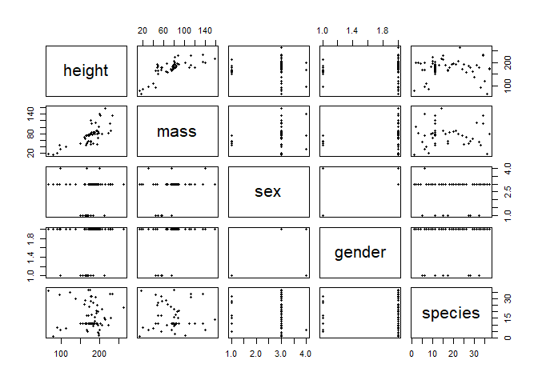<!-- -->

`pairs.panels` from the `{psych}` package is a more elaborative form of it, including correlation scores and various output/layout options. These may help especially when inspecting more variables at once, for instance by starring or scaling up the font of high correlation coefs.

```r
psych::pairs.panels(sw[-16,c(2,3,8,9, 11)], method = "pearson", density=T, stars=T, ellipses=F)      # also available: spearman and kendall correlation
```

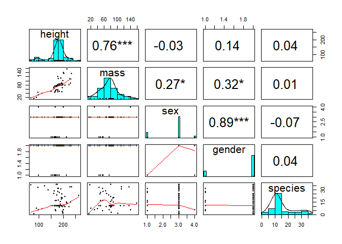<!-- -->

```r
psych::pairs.panels(sw[-16,1:11], method = "pearson", density=T, scale=T, ellipses=F, stars=T)  
```

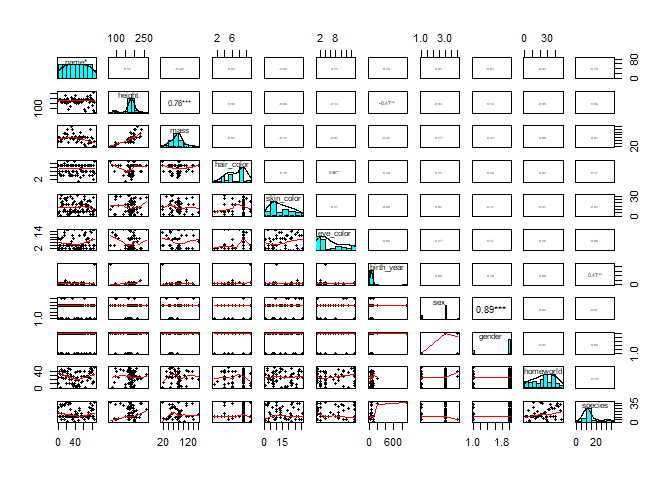<!-- -->


The `eda.uni` function in `{QuantPsyc}` is a good start for inspecting univariate distributions, as it combines four relevant plots: histogram, density plot, normal plot and boxplot.

```r
eda.uni(sw$height, title="Univariate Distribution of Height")  # 4 plots in one :)
```

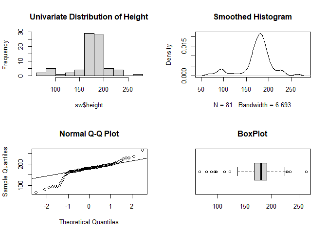<!-- -->


There are various plot options, which can be parametrised in numerous ways. `plot` as the simplest of them will adjust to the given variable type/types. 

```r
par(mfrow=c(2,2))   # sets visual parameter for showing the following plots in a 2x2 grid pattern
plot(sw$mass, pch=20, col="orange"); lines(smooth(na.omit(sw$mass)))   # smooth = Tukey's (running median) smoothing; writing 2 lines of code into one by separating them with ";" 
plot(sw$sex, col=3)  # colour can also be given as integer
plot(sw$mass[sw$mass < 1000], sw$height[sw$mass < 1000], pch=15)   # with subsetting the data; "pch" parameter refers to the shape of points
plot(sw$gender, sw$height, pch=20, main="Height in Star Wars characters", horizontal=T) 
```

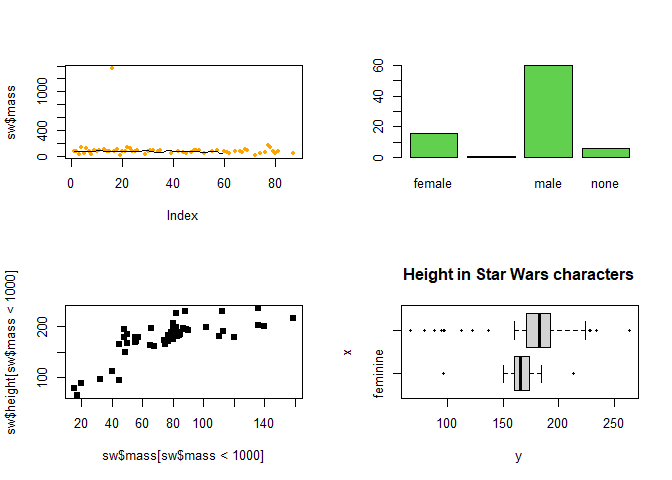<!-- -->


Certain plots can be addressed by basic commands like `hist`, `boxplot`, `barplot` or `mosaicplot`.

```r
par(mfrow=c(2,2))   
hist(sw$height, breaks=5, col=18)    # with given number of bins
boxplot(sw$height[sw$sex=="female"], horizontal = T, pch=20, main="Height in female Star Wars characters")   # with female sex filter
barplot(sw$height, col=7, border=7)   # border sets the colour of the shape margins
mosaicplot(table(sw$sex, sw$gender), col=5:6)
```

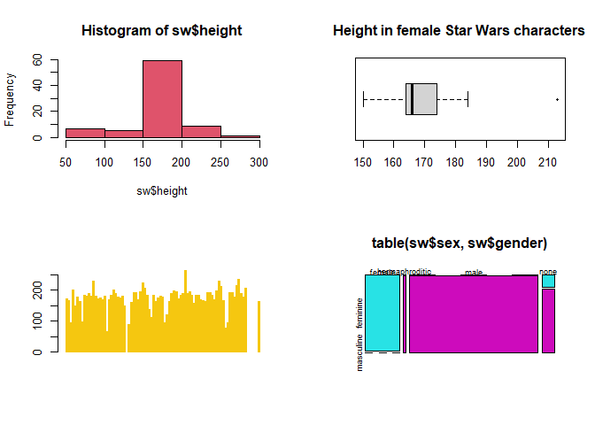<!-- -->


`histogram` and `bwplot` from the `{lattice}` package offer easy plots for grouped variables.
Note that adressing a function with its full package name like `package::command` makes sure to get the right command if there are homonymous ones.

```r
lattice::histogram(~height|sex, data=sw)    # histogram of height by sex groups
```

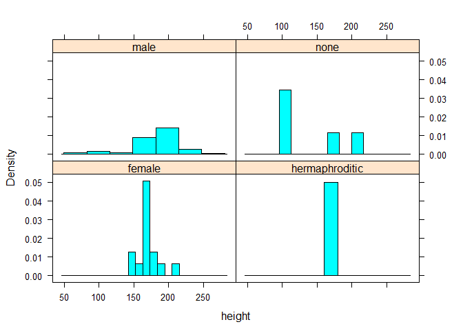<!-- -->

```r
lattice::bwplot(sex~height, data=sw)    # boxplot of height by sex groups
```

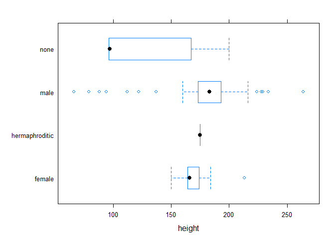<!-- -->

As noted before there are far more elaborate options to plot data, first and foremost with the `{ggplot2}` package. We won't dive into this, but give a short view on it by using the `{ggfomula}` shortcuts for it. With their shortened grammar there are also a good compromise between quickness and nice view for EDA.

```r
# further ggformula plots are for instance gf_histogram(), gf_dens(), gf_freqpoly(), gf_dotplot(), gf_bar(), gf_violin, along several layout options
gf_qq(~ height, data=sw)     # normal plot for height
```

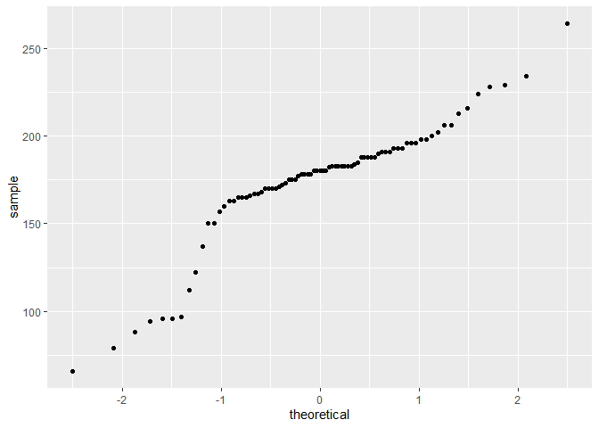<!-- -->

```r
gf_point(mass ~ height | sex, data=sw, size=2, col=2)      # height vs. mass grouped by sex
```

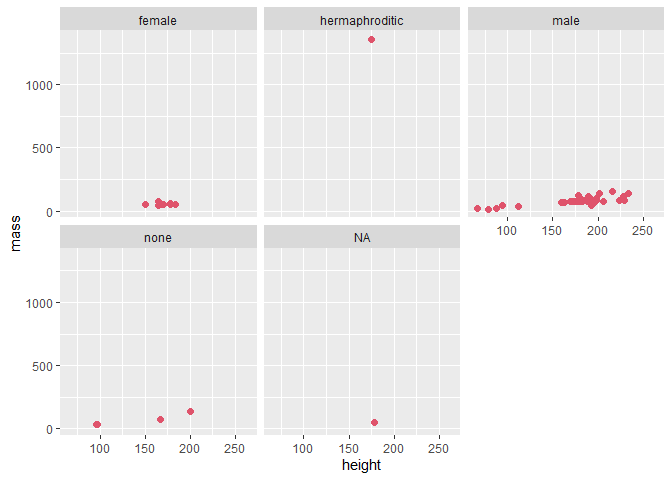<!-- -->

```r
gf_density(~ height,  colour=~sex, data=sw, alpha=0.5, fill=~sex)       # density plot for height gouped by sex
```

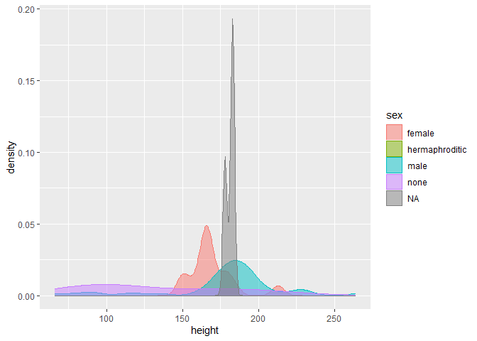<!-- -->

```r
gf_smooth(mass ~ height, color=~sex, data=sw, size = 1)     # loess is standard smoothing method
```

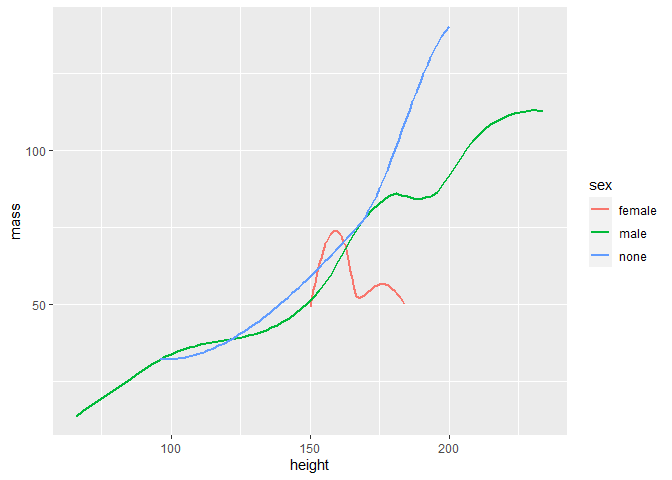<!-- -->


